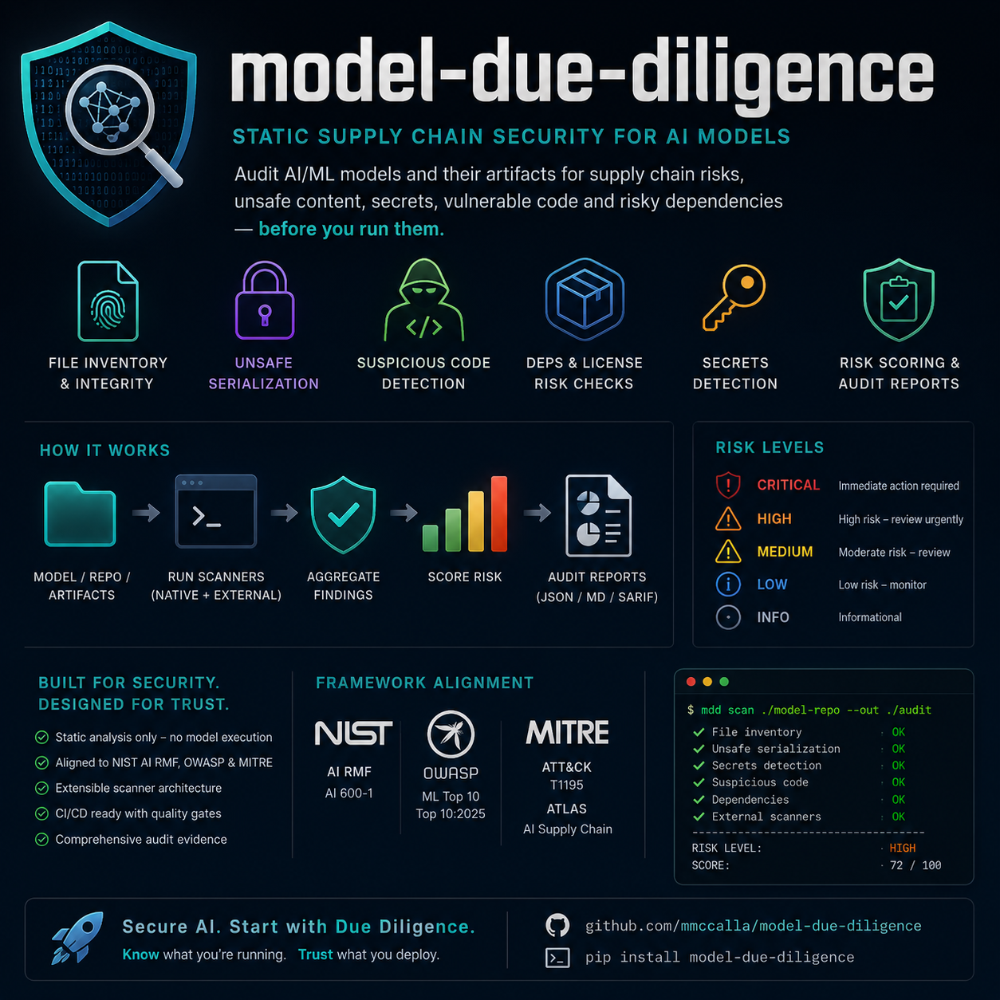
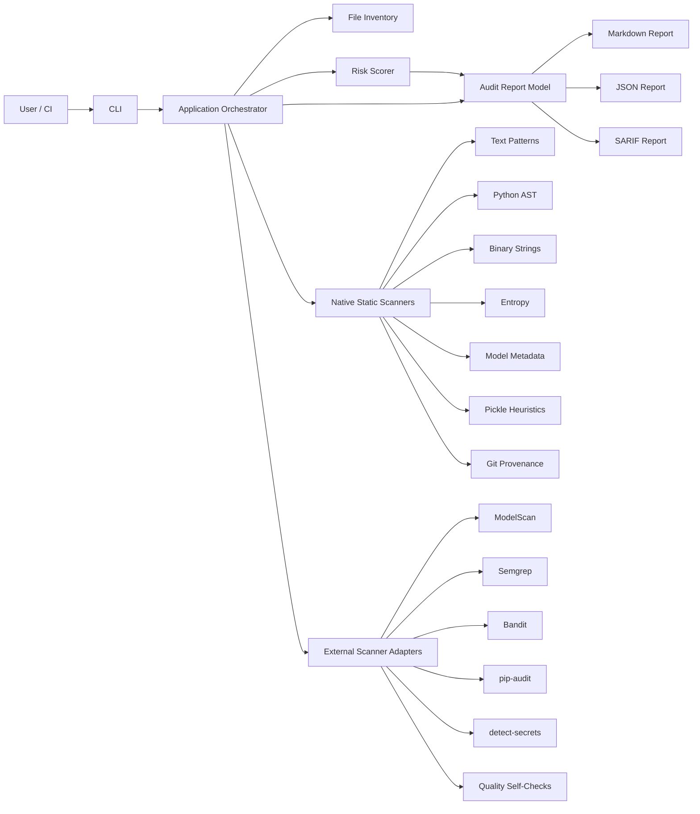
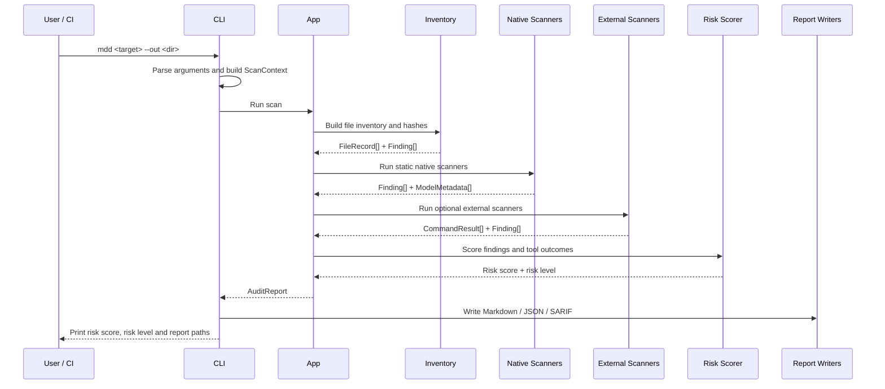

# Model Due Diligence

[](https://github.com/mmccalla/model-due-diligence/actions/workflows/ci.yml)
[](https://github.com/mmccalla/model-due-diligence/actions/workflows/codeql.yml)
[](https://pypi.org/project/model-due-diligence/)
[](https://pypi.org/project/model-due-diligence/)
[](LICENSE)

<p align="center">
  
</p>

> **Alpha software.** Static supply-chain gate for local AI model files and cloned repositories — before you load them into Ollama, llama.cpp, LM Studio or Transformers.

**TL;DR:** Run `mdd` on a model path. Review the report. Do not treat a clean scan as proof of safety.

```zsh
pip install model-due-diligence
mdd ./path/to/model-or-repo --out ./audit --skip-external
```

Try the bundled demo fixture (no download required):

```zsh
git clone https://github.com/mmccalla/model-due-diligence.git
cd model-due-diligence
./scripts/dev-setup.sh && source .venv/bin/activate
./examples/demo.sh
```

Or after cloning, run the demo directly:

```zsh
./examples/demo.sh ./audit-demo
```

**Canonical command:** `mdd` (also available as `model-due-diligence` and `python -m model_due_diligence`).

`model-due-diligence` is a Python command-line tool for performing **static supply-chain due diligence** on local AI model files and cloned model repositories before they are imported into runtimes such as Ollama, llama.cpp, LM Studio or Transformers.

It is designed to help answer one practical question:

> “Is there obvious static evidence that this model artefact or repository should not be trusted, loaded or run without further review?”

It reduces practical risk from unsafe serialisation, suspicious repository content, weak provenance, exposed secrets, unexpected binaries, unsafe dependency files and malformed model metadata.

It does **not** prove that a model is safe.

A clean report means only that this tool did not identify the specific static artefact risks it is designed to detect. It must not be treated as proof that model weights, repository content, runtime behaviour or downstream use are benign.

---

## Contents

- [What the tool does](#what-the-tool-does)
- [What the tool does not do](#what-the-tool-does-not-do)
- [Architecture](#architecture)
- [Scanner coverage](#scanner-coverage)
- [Risk scoring](#risk-scoring)
- [Install](#install)
- [Quick start](#quick-start)
- [CLI reference](#cli-reference)
- [Example workflows](#example-workflows)
- [Reports and outputs](#reports-and-outputs)
- [Recommended operating model](#recommended-operating-model)
- [Development workflow](#development-workflow)
- [Testing and quality gates](#testing-and-quality-gates)
- [Repository structure](#repository-structure)
- [Security posture](#security-posture)
- [Standards alignment](#standards-alignment)
- [Limitations](#limitations)
- [Roadmap](#roadmap)
- [Contributing](#contributing)
- [Licence](#licence)

---

## What the tool does

`model-due-diligence` statically inspects a local path and generates reviewable evidence.

It checks:

- file inventory, SHA-256 hashes, permissions and symlinks;
- high-risk serialisation formats such as pickle, `.pt`, `.pth`, `.bin`, `.joblib` and H5;
- lower-risk model formats such as `.gguf`, `.safetensors` and `.onnx`;
- GGUF magic bytes and version metadata;
- safetensors header metadata;
- suspicious text and binary strings;
- Python AST indicators such as `eval`, `exec`, `compile`, `pickle.loads`, `os.system` and `subprocess`;
- `trust_remote_code=True` usage in Python and text files;
- risky pickle-like byte markers in high-risk serialisation formats;
- high-entropy non-model files;
- Git provenance, origin remote, current commit, dirty worktree and Git LFS listing where available;
- external scanner output from ModelScan, Semgrep, Bandit, pip-audit and detect-secrets;
- optional quality self-checks using Ruff, Pyright and mypy **against this scanner project** when `--quality-self-check` is enabled;

The tool produces:

- a human-readable Markdown report;
- a deterministic JSON report for automation;
- an optional SARIF report for code-scanning workflows;
- raw external scanner outputs where external tools are run.

---

## What the tool does not do

The tool is intentionally static. During normal scanning it does **not**:

- load model weights;
- import untrusted repository code;
- execute model-specific scripts;
- run model inference;
- send artefacts to external services;
- require network access for local scanning;
- decide automatically that a model is safe.

Static scanning cannot reliably detect:

- malicious behaviour encoded directly into model weights;
- sleeper-agent or trigger-based backdoors;
- training-data poisoning;
- benchmark-specific manipulation;
- malicious behaviour that appears only after fine-tuning;
- malicious behaviour that appears only after tools are connected;
- prompt-injection obedience in downstream RAG or agent workflows;
- data exfiltration behaviour that only appears at runtime;
- vulnerabilities in local model runtimes;
- all unsafe deserialisation evasions.

Use it as a **risk-reduction gate**, not as a trust oracle.

---

## Architecture

The project uses a **modular monolith** architecture. This keeps installation and local execution simple while maintaining clear internal boundaries between CLI, orchestration, scanners, risk scoring and reports.



### Runtime flow



### Internal dependency direction

Dependencies should flow in one direction:

```text
cli -> app -> domain
app -> inventory
app -> scanners
app -> external
app -> reporting
scanners -> domain/config/utils
external -> domain/config/command_runner
reporting -> domain/config
```

Rules:

- scanners must not import `app`;
- reporters must not run scanners;
- external adapters must not write final project reports directly;
- domain models must not depend on filesystem, subprocess or reporting modules;
- native scanners must not execute model artefacts or repository code.

---

## Scanner coverage

| Coverage area | Native support | External support | Status |
|---|---:|---:|---|
| File inventory, hashes and permissions | Yes | No | Covered |
| Symlink detection | Yes | No | Covered |
| Executable/script detection | Yes | Semgrep / Bandit | Covered |
| High-risk serialisation detection | Yes | ModelScan | Covered |
| Pickle heuristic indicators | Yes | ModelScan | Covered |
| GGUF header inspection | Yes | No | Basic coverage |
| Safetensors header inspection | Yes | No | Basic coverage |
| Suspicious text/code patterns | Yes | Semgrep / Bandit | Covered |
| Python AST dangerous-call detection | Yes | Bandit / CodeQL | Covered |
| Binary string indicators | Yes | No | Basic coverage |
| High-entropy anomaly detection | Yes | No | Basic coverage |
| Pattern-based secret indicators | Yes (heuristic) | detect-secrets | Covered |
| Dependency vulnerability checks | No | pip-audit | Covered for supported dependency files |
| Git provenance checks | Yes | No | Basic coverage |
| This project's code quality | No | Ruff / Pyright / mypy / pytest | CI only; optional `--quality-self-check` |
| This repository semantic security analysis | No | CodeQL | CI only — does not scan your model checkout |
| SARIF output | Yes | CodeQL native SARIF | Covered (default output format) |
| SBOM generation | No | No | Planned |
| Sigstore / SLSA provenance | No | No | Planned |
| Licence compatibility checks | No | No | Planned |
| Model-card quality checks | No | No | Planned |
| Weight-level backdoor detection | No | No | Not reliably detectable |
| Runtime behavioural testing | No | No | Planned separately |

---

## Risk scoring

Findings are normalised into severities and converted into a bounded score from `0` to `100`.

| Severity | Current score contribution |
|---|---:|
| INFO | 0 |
| LOW | 3 |
| MEDIUM | 10 |
| HIGH | 30 |
| CRITICAL | 60 |

External scanner non-zero exits can also contribute to the score when the tool was available and produced reviewable signals.

| Risk level | Score range | Meaning | Recommended action |
|---|---:|---|---|
| LOW | 0-29 | No obvious supported static artefact risks were found | Acceptable for sandboxed first run |
| MEDIUM | 30-69 | Reviewable findings exist | Do not import until findings are understood |
| HIGH | 70-89 | Material risk indicators exist | Do not load unless every finding is justified |
| CRITICAL | 90-100 | Severe or multiple high-risk indicators exist | Treat as unsafe by default |

The score is intentionally conservative. It is a decision aid, not an automated trust verdict.

---

## Install

### Prerequisites

- Python 3.11 or later;
- Git;
- a Unix-like shell for the provided scripts;
- optional external scanner CLIs if you want full coverage.

### Install from PyPI

```zsh
pip install model-due-diligence
```

For optional external scanner integrations:

```zsh
pip install "model-due-diligence[scanners,semgrep]"
```

### Development setup

```zsh
python3 -m venv .venv
source .venv/bin/activate
python -m pip install --upgrade pip
python -m pip install -e ".[dev,scanners,semgrep]"
```

Or use the setup script:

```zsh
./scripts/dev-setup.sh
```

For a lighter install without optional scanner integrations:

```zsh
./scripts/dev-setup.sh --no-scanners
```

### Verify installation

```zsh
mdd --help
mdd-ollama --help
model-due-diligence --help
python -m model_due_diligence --help
```

---

## Quick start

Scan a cloned model repository:

```zsh
mdd ./downloaded-model --out ./audit
```

Scan a local GGUF file:

```zsh
mdd ~/models/qwen.gguf --out ./audit-qwen
```

Scan an installed Ollama model by name:

```zsh
mdd-ollama qwen3:4b --out ./audit-qwen3-ollama
```

Fail the command when the risk level is medium or above:

```zsh
mdd ./downloaded-model --out ./audit --fail-on medium
```

Run a fast smoke scan without optional external tools:

```zsh
mdd tests/fixtures/safe_repo \
  --out ./audit-smoke \
  --fail-on critical \
  --skip-external
```

Generate only JSON output:

```zsh
mdd ./downloaded-model \
  --out ./audit-json \
  --format json
```

---

## CLI reference

```text
usage: model-due-diligence [-h] [--out OUT] [--timeout TIMEOUT]
                           [--format FORMATS] [--skip-external]
                           [--skip-modelscan] [--skip-semgrep]
                           [--skip-bandit] [--skip-pip-audit]
                           [--skip-detect-secrets]
                           [--skip-quality-self-check]
                           [--quality-self-check]
                           [--fail-on {low,medium,high,critical}]
                           [--version]
                           target
```

| Argument | Description |
|---|---|
| `target` | Path to a model file or model directory |
| `--out` | Output report directory |
| `--timeout` | Per-tool timeout in seconds |
| `--format` | Comma-separated report formats: `markdown,json,sarif` |
| `--skip-external` | Skip all optional external scanner tools |
| `--skip-modelscan` | Skip ModelScan only |
| `--skip-semgrep` | Skip Semgrep only |
| `--skip-bandit` | Skip Bandit only |
| `--skip-pip-audit` | Skip pip-audit only |
| `--skip-detect-secrets` | Skip detect-secrets only |
| `--quality-self-check` | Run Ruff, Pyright and mypy against this project as optional self-checks |
| `--skip-quality-self-check` | Skip quality self-checks |
| `--fail-on` | Return non-zero when risk is at or above the selected level |
| `--version` | Print package version |

### `mdd-ollama`

`mdd-ollama` resolves an installed Ollama model from the local
`OLLAMA_MODELS` store, stages scan-friendly filenames in a temporary directory,
and then runs the normal static due-diligence flow on that staged directory.

It does not require the Ollama server to be running as long as the local
manifest and blob store is present.

```text
usage: mdd-ollama [-h] [--ollama-models-dir OLLAMA_MODELS_DIR] [--out OUT]
                  [--timeout TIMEOUT] [--format FORMATS] [--skip-external]
                  [--skip-modelscan] [--skip-semgrep] [--skip-bandit]
                  [--skip-pip-audit] [--skip-detect-secrets]
                  [--skip-quality-self-check] [--quality-self-check]
                  [--fail-on {low,medium,high,critical}] [--keep-staged]
                  model
```

Typical usage:

```zsh
mdd-ollama llama3:8b --out ./audit-llama3
```

For an uninstalled checkout, run it with:

```zsh
PYTHONPATH=src python3 -m model_due_diligence.ollama_cli llama3:8b --out ./audit-llama3
```

---

## Example workflows

### Audit a Hugging Face clone

Use the helper script:

```zsh
./examples/audit-huggingface-clone.sh \
  https://huggingface.co/Qwen/Qwen3-8B-GGUF \
  ./audit-qwen3
```

The script clones into a temporary directory, runs the scanner, writes reports to the output directory and removes the temporary clone afterwards.

### Audit a local GGUF file

```zsh
./examples/audit-local-gguf.sh \
  ~/models/qwen3-8b-q4_k_m.gguf \
  ./audit-qwen3-gguf
```

### Audit an installed Ollama model

```zsh
./examples/audit-installed-ollama.sh \
  qwen3:4b \
  ./audit-qwen3-ollama
```

### Use in CI

A conservative CI smoke gate can run without optional external scanners:

```zsh
mdd tests/fixtures/safe_repo \
  --out ./audit-smoke \
  --fail-on critical \
  --skip-external
```

A fuller CI gate can install scanner extras and run:

```zsh
mdd ./downloaded-model \
  --out ./audit \
  --fail-on high
```

---

## Reports and outputs

A normal run can produce:

```text
audit/
├── model_due_diligence_report.md
├── model_due_diligence_report.json
├── model_due_diligence_report.sarif
├── modelscan.json
├── semgrep.json
├── bandit.json
├── pip-audit-<hash>.json
└── detect-secrets.json
```

| File | Purpose |
|---|---|
| `model_due_diligence_report.md` | Human-readable review report |
| `model_due_diligence_report.json` | Machine-readable deterministic report |
| `model_due_diligence_report.sarif` | Static-analysis output suitable for code-scanning workflows |
| `modelscan.json` | Raw ModelScan output |
| `semgrep.json` | Raw Semgrep output |
| `bandit.json` | Raw Bandit output |
| `pip-audit-<hash>.json` | Raw pip-audit output per requirements file |
| `detect-secrets.json` | Raw detect-secrets output |

Generated audit outputs may contain local paths, hashes, snippets and scanner evidence. Do not commit them unless you have reviewed them for sensitive content.

---

## Recommended operating model

Use `model-due-diligence` as one control in a broader model supply-chain process:

```text
Official or reputable source
+ pinned commit or hash
+ static due-diligence scan
+ first run in a no-network sandbox
+ no credentials mounted
+ restricted filesystem access
+ adversarial behavioural test suite
+ runtime monitoring
+ human review
= reasonable practical risk reduction
```

Recommended practice:

1. Prefer official publisher repositories or reputable quantisers.
2. Avoid floating tags such as `latest` for operational use.
3. Pin exact Git revisions and record SHA-256 hashes.
4. Run `model-due-diligence` before importing or loading artefacts.
5. Review all HIGH and CRITICAL findings manually.
6. Run first inference in a network-disabled container or VM.
7. Do not mount API keys, SSH keys, cloud credentials or client data.
8. Test prompt-injection and tool-use behaviour before RAG or agent deployment.
9. Keep reports and accepted hashes for reproducibility.

---

## Development workflow

Set up the environment:

```zsh
./scripts/dev-setup.sh
source .venv/bin/activate
```

Run quality gates:

```zsh
./scripts/run-quality.sh
```

Run tests:

```zsh
./scripts/run-tests.sh
```

Build the package:

```zsh
./scripts/build-package.sh
```

Build without running local checks first:

```zsh
./scripts/build-package.sh --skip-checks
```

---

## Testing and quality gates

The expected local quality gates are:

```zsh
ruff format --check src tests
ruff check src tests
pyright
mypy src tests
pytest
mdd tests/fixtures/safe_repo --out ./audit-smoke --fail-on critical --skip-external
```

The helper script runs the same pattern:

```zsh
./scripts/run-quality.sh
```

Use fix mode for Ruff formatting and safe lint fixes:

```zsh
./scripts/run-quality.sh --fix
```

Run unit tests only:

```zsh
./scripts/run-tests.sh --unit
```

Run integration tests only:

```zsh
./scripts/run-tests.sh --integration
```

Run with coverage:

```zsh
./scripts/run-tests.sh --coverage
```

---

## Repository structure

```text
model-due-diligence/
├── .github/
│   ├── workflows/
│   │   ├── ci.yml
│   │   ├── codeql.yml
│   │   └── release.yml
│   ├── dependabot.yml
│   └── pull_request_template.md
├── docs/
│   ├── architecture.md
│   ├── contribution-guide.md
│   ├── limitations.md
│   ├── scanner-coverage.md
│   ├── standards-alignment.md
│   └── threat-model.md
├── examples/
│   ├── audit-installed-ollama.sh
│   ├── audit-huggingface-clone.sh
│   ├── audit-local-gguf.sh
│   ├── demo.sh
│   └── sample-report.md
├── scripts/
│   ├── build-package.sh
│   ├── dev-setup.sh
│   ├── run-quality.sh
│   └── run-tests.sh
├── src/model_due_diligence/
│   ├── cli.py
│   ├── app.py
│   ├── config/
│   ├── domain/
│   ├── external/
│   ├── inventory/
│   ├── ollama.py
│   ├── ollama_cli.py
│   ├── reporting/
│   ├── scanners/
│   └── utils.py
├── tests/
│   ├── fixtures/
│   ├── integration/
│   └── unit/
├── .env.example
├── .gitattributes
├── .gitignore
├── .python-version
├── LICENSE
├── pyproject.toml
└── README.md
```

The published PyPI wheel contains only `src/model_due_diligence/`. The optional `skills/` and `skills_docs/` directories are contributor/agent-development libraries for this repository and are **not** part of the installable CLI package.

Release and PyPI publishing steps are documented in [`docs/publishing.md`](docs/publishing.md).

---

## Security posture

The project follows these design rules:

- static by default;
- no model execution during scanning;
- no untrusted repository code execution during scanning;
- no shell invocation for external scanner commands;
- external tool failures are visible in reports;
- findings include severity, category, file, message, evidence where available and recommendation;
- missing scanners are reported rather than silently ignored;
- generated reports are ignored by Git by default;
- real model artefacts are ignored by Git by default;
- dependency updates are managed through Dependabot;
- CodeQL runs through GitHub Actions;
- releases build source and wheel distributions and validate metadata before publishing.

---

## Standards alignment

An explicit control mapping for relevant NIST, MITRE, and OWASP guidance is in
[docs/standards-alignment.md](docs/standards-alignment.md).

---

## Limitations

A clean report does not mean a model is safe.

Static checks cannot reliably detect:

- subtle weight-level backdoors;
- sleeper-agent behaviour;
- poisoned training data;
- malicious behaviour activated by rare prompts;
- malicious behaviour activated only through tool use;
- all deserialisation evasions;
- all obfuscated payloads;
- prompt-injection obedience in downstream RAG or agent workflows;
- runtime exfiltration behaviour;
- vulnerabilities in Ollama, llama.cpp, LM Studio, Transformers or other runtimes.

This tool should not be the sole approval mechanism for regulated production deployment, client-data processing, internet-connected agentic systems, autonomous coding agents with write access, or systems with access to secrets or privileged infrastructure.

---

## Roadmap

Planned or candidate improvements:

- fuller GGUF metadata validation;
- safetensors tensor offset and shape validation;
- Hugging Face metadata retrieval using pinned revisions;
- SBOM generation;
- Sigstore or SLSA provenance checks;
- licence compatibility checks;
- model-card quality scoring;
- SARIF upload workflow;
- sandboxed behavioural test harness for local inference;
- prompt-injection and tool-use behavioural tests for RAG and agent workloads.

---

## Contributing

See [`CONTRIBUTING.md`](CONTRIBUTING.md) and [`docs/contribution-guide.md`](docs/contribution-guide.md).

Before opening a pull request, run:

```zsh
./scripts/run-quality.sh
```

Contributions should preserve the project’s core boundary: scanning must remain static by default and must not execute untrusted model artefacts or repository code.

---

## Licence

Licensed under the Apache License, Version 2.0. See [`LICENSE`](LICENSE).
